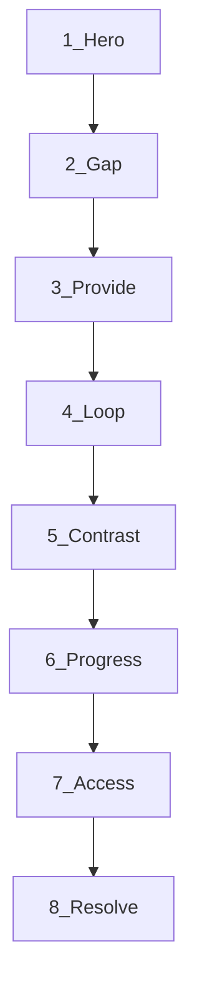

# Allr landing page — story & design thinking

**Status:** Review artifact. Not implementation.  
**Sources:** [`ALLR_UPDATED_MASTER_STORY.md`](./ALLR_UPDATED_MASTER_STORY.md), [`DESIGN.md`](./DESIGN.md), [`MOTION.md`](./MOTION.md), [`src/lib/brand.ts`](./src/lib/brand.ts)  
**Audience for this doc:** Product and design review before a separate implementation pass.

---

## 1. Purpose & how to use

This file rewrites the **homepage as a product story**, then describes how each beat should look and move. It exists so we can agree on narrative and design intent before touching React.

| Do with this doc | Do not |
|---|---|
| Review section order, copy intent, visual jobs | Ship code from this file alone |
| Mark `LOCK` vs `PROPOSE` lines for `brand.ts` / `DESIGN.md` | Invent a second brand voice or fourth hue |
| Use it as the brief for a later implementation task | Put investor narrative (raise, ARR, market size) on the door |

**Relationship to other contracts**

- **Master story** — product thesis, acts, language guardrails. This page uses the *door-safe* product cuts only.
- **DESIGN.md** — tokens, voice, CTAs, page rhythm. Visual proposals stay inside that contract.
- **MOTION.md** — only the four verbs: Settle, Ink, Live, Glow. No new motion language.
- **brand.ts** — locked strings today. Anything tagged `PROPOSE` is a candidate change after review; `LOCK` stays as shipped until explicitly updated.

---

## 2. Research principles (applied)

Distilled from product-landing practice (StoryBrand / SB7, narrative-scroll SaaS pages, objection-ordered section design). Applied to Allr — not copied as jargon.

| Principle | Allr implication |
|---|---|
| The page is a **sequenced argument**, not a feature brochure | Each section retires one doubt; order matters more than polish |
| The **customer is the hero**; the product is the **guide** | Speak to “you”; Allr holds the operating layer |
| **New category** needs recognition before mechanism | Name the stuckness before listing harnesses |
| **One idea per viewport** | No hero feature grids, no competing CTAs in one band |
| **Bridges** — last lines raise the next question | Sections feel like chapters, not stacked modules |
| **Proof must match the claim** | Named testimonials stay off the public door until chosen; use pattern-proof, product-in-action, honest progress |
| **Investor narrative stays off the door** | No raise, ARR scenarios, market sizing, or founder bios on `/` |

**Chosen pattern:** Problem → Solution → Mechanism → Outcomes → Contrast → Honest progress → Access → Resolve.

Show product evidence early (hero workspace demo), but do **not** lead with a pure demo-only hero that assumes the visitor already knows the category.

---

## 3. Story spine

### One sentence visitors should leave with

> AI made creation abundant. Allr is the product-and-operations platform that turns AI capability into products you can deploy, run, maintain, and scale.

### StoryBrand map (door-safe)

| Beat | Content |
|---|---|
| **Hero** | People and teams moving an AI product from prototype toward something that can run, reach customers, and be maintained |
| **Want** | A dependable operating product — not another partial output |
| **Problem (external)** | Creation is cheap; journeys, state, deploy, billing, ops, and maintenance are still fragmented |
| **Problem (internal)** | Token loops feel like progress while the product never becomes real |
| **Guide** | Allr — Cloud AI Workspace; product, intelligence, and maintenance layers in plain language |
| **Plan** | Ideate → Create → Deploy → Operate → Maintain → Scale |
| **CTA** | Get Started → `/login/` (primary). Soft doors: Download, See how it works |
| **Failure** | Keep rebuilding plumbing; prototypes stall; context lost between tools |
| **Success** | A live, maintained product that keeps operating after the generation step |

### Quiet analogy

WordPress standardized publishing infrastructure. Allr aims to standardize the repeated product-and-operations infrastructure under AI-enabled products.

**Rule:** Never the hero lead. At most one aside or late whisper. Never “CMS for AI.”

### Primary wedge (first conversation)

Not: “Would you like an AI assistant?”  
Yes: “What AI product are you trying to bring into production — and what is blocking it from becoming dependable?”

Homepage copy should answer that question visually and verbally.

---

## 4. What is wrong with the current page (diagnosis)

Current order in [`src/app/page.tsx`](./src/app/page.tsx):

Hero → Gap → Provide → HowItWorks → Contrast → PlatformProgress → Access → AllrPromise → Faq → FinalCta.

| Issue | Effect |
|---|---|
| Sections read as **stacked modules** more than a single argument | Visitors can rearrange blocks mentally; no earned progression |
| **AccessBand** and **OnYourPhone** used to repeat “same product, more doors” | Two sections, one doubt — now merged into Access |
| **Promise** appears mid/late as its own band while hero already carries CTA | Dilutes climax of Final CTA |
| No explicit **contrast** to chat / builders / cloud glue | Category confusion survives past Provide |
| Residual risk of **catalogue energy** (older Bloom / OUTPUTS framing) | Competes with “operating product” thesis |

The rewrite below keeps mentor voice and tokens, but reorders and reframes so each scroll stop earns the next.

---

## 5. Proposed section arc

```text
1. Hero          — category + outcome + one workspace beat
2. Gap           — paradox, tax, token trap
3. Provide       — six petal beats (harnesses + audience); Outcomes absorbed
4. Loop          — operating lifecycle
5. Contrast      — why not chat / builder / raw cloud
6. Progress      — honest Available / In progress / Upcoming
7. Access        — web · desktop · mobile (one section; phone subordinated)
8. Resolve       — promise (quiet) · FAQ · Final CTA
```



### Cuts & merges

| Current | Decision |
|---|---|
| AccessBand + OnYourPhone | **Merge** into one Access section; phone is a secondary vignette, not a peer chapter |
| Outcomes as a standalone chapter | **Absorb** into Provide as petal beats 3–5 (builders, teams, agencies & operators); `OUTCOMES` deprecated |
| Bloom / creative OUTPUTS catalogue | **Stay off** homepage |
| Named case studies (Shubham, Tannmay, …) | **Stay off** public door; pattern only |
| Second full-width Promise band | **Demote** to a single line above FAQ or absorb into Final CTA |
| Investor slides / market sizing | **Never** on `/` |

---

## 6. Tag legend for copy

| Tag | Meaning |
|---|---|
| `LOCK` | Keep exact string from `brand.ts` / DESIGN.md until a deliberate vocabulary update |
| `PROPOSE` | New or revised copy for review; would update `brand.ts` / DESIGN.md before implementation |
| `DESIGN` | Visual / layout / motion intent only |

---

## 7. Section-by-section rewrite

---

### 7.1 Hero — category and outcome

**Doubt retired:** “Is this for me? What is it?”

**Master story:** One-sentence + short version (door-safe).

#### Copy

| Role | Draft | Tag |
|---|---|---|
| Brand signal | `Allr` (wordmark + letterpress stamp) | `LOCK` |
| Headline | The product-and-operations platform for the AI era. | `LOCK` (align casing to DESIGN.md sentence case: “the product-and-operations platform for the AI era.”) |
| Subhead | Turn AI capability into products you can deploy, run, and maintain. | `LOCK` (`HERO_SUB`) — optional `PROPOSE` lengthen: “A persistent workspace where you ideate, create, deploy, operate, and maintain AI-enabled products.” only if hero feels too thin |
| Primary CTA | Get Started | `LOCK` → `/login/` |
| Secondary CTA | See how it works | `LOCK` → `#loop` (or `#how`) |
| Reassurance | Open an account and start when you’re ready. | `LOCK` (`CTA.reassurance`) |
| Demo caption | Ideate once. Build in a persistent workspace. Deploy it, then keep operating it. | `LOCK` (`WORKSPACE_DEMO.caption`) |
| Demo prompt (in UI) | A workspace for our research product: capture the brief, keep state, and keep it running after we deploy. | `LOCK` |

**Do not put in the hero:** stats, pricing, platform progress chips, audience cards, WordPress analogy, petal catalogue.

#### Design thinking

| Concern | Intent |
|---|---|
| Composition | One composition. Brand-first: mark + `allr` must survive the “remove the nav” test. Two-column on desktop: copy left, Launch Console right. Full-bleed atmosphere via AmbientShader only — no inset hero card as the *only* visual idea |
| Hero budget | Brand, one headline, one short supporting sentence, one CTA group, one dominant product visual. Nothing else |
| Hierarchy | Young Serif for Allr + headline rest; Nunito for sub and CTAs. Green primary button only |
| Product visual | Launch Console — one honest workspace beat (`WORKSPACE_DEMO`), not a carousel of creative outputs |
| Cards | None in the hero |
| Motion | Hero copy rises (~0.9s). Console: **Settle** → **Ink** → **Live** → soft **Glow** on the live surface. One verb at a time. `prefers-reduced-motion`: jump to Live frame |
| Bridge out | Last beat of the console says “It’s operating.” Next section answers: *why that still fails everywhere else* |

#### Transition bridge (spoken in layout, optional whisper)

> Generation got easy. Finishing did not.

---

### 7.2 Gap — the paradox and the tax

**Doubt retired:** “Do they understand why I’m stuck?”

**Master story:** Act I — AI paradox, repeated infrastructure tax, token trap.

#### Copy

| Role | Draft | Tag |
|---|---|---|
| Title | Generated output is not a product. | `LOCK` (`GAP.title`) |
| p1 | AI made creation abundant. Code, interfaces, agents, research, and media arrive fast. Finishing and running them did not get easier. | `LOCK` |
| p2 | Prototypes still stall without journeys, state, deploy, monitoring, and maintenance. Token loops feel like progress without an operating outcome. | `LOCK` |
| Close | Allr changes the unit of value from generated output to operating product outcome. | `LOCK` |

**Optional agitation beat** (`PROPOSE` — only if Gap feels soft after review):

> Every new build rebuilds the same foundation: accounts, journeys, billing, deploy, monitoring, support. The insight is unique. The plumbing is not.

Keep the optional beat to **one short paragraph**. Do not list all ten infrastructure steps on the marketing door.

**Optional visual aside** (`PROPOSE` reuse of `PROBLEM_STACK`):

```text
Chat tools · partial outputs
Builders · stop at the prototype
Billing · assembled by hand
Deploy · another vendor
Ops · someone else’s dashboard
```

Tone: struck-through or quiet “junk” treatment (existing JunkPill language), then a single green “one workspace” counterweight — not a comparison table of vendors.

#### Design thinking

| Concern | Intent |
|---|---|
| Composition | Two-column on desktop (essay left \| junk aside right); stack on mobile. Max prose measure ~640px, left-aligned. Space, not a hairline rule, separates from hero |
| Atmosphere | Paper + shader only. No tinted section band. Tension through typography weight and the junk stack — not red drama (`alert` is for forms only) |
| Motion | Reveal: fade + 18px up. If junk stack exists, stagger 45–70ms. No looping |
| Cards | Prefer none. If junk stack needs containers, soft rectangles with `line` border — interactive weight not required |
| Bridge out | Close line sets up: *So what do you get instead?* |

---

### 7.3 Provide — harnesses + who it’s for (petal mark)

**Doubt retired:** “What do I actually get?” / “Will it work for someone like me?”

**Master story:** Act II harnesses + Act IV audiences (Outcomes chapter absorbed).

#### Copy

| Role | Draft | Tag |
|---|---|---|
| Title | What you get. | `LOCK` (`PROVIDE.title`) |
| Sub | You spend time on what’s unique to your customer. Allr holds the repeated operating layer. | `LOCK` |
| Petal 0 | Build the product — From brief to live surface… | `LOCK` |
| Petal 1 | Run the intelligence — Research and continuous work… | `LOCK` |
| Petal 2 | Keep it alive — History, procedures, and recovery… | `LOCK` |
| Petal 3 | AI product builders — You can generate a prototype… | `LOCK` (from retired Outcomes) |
| Petal 4 | Product teams — One environment for experiments… | `LOCK` |
| Petal 5 | Agencies & operators — Repeatable delivery + workflows that stay running | `LOCK` (merged agencies + operators) |

**Internal glossary (do not lead with these words on the page):** Product Harness, Intelligence Harness, Maintenance Harness. Mentor voice first; jargon only if a whisper label is useful for power users.

Harness whispers (aside, honey-deep): “The product / intelligence / maintenance harness.” Audience petals whisper “Same barrier. Different work.”

#### Design thinking

| Concern | Intent |
|---|---|
| Composition | Section head + two-column desktop: large interactive Allr mark \| one active message (title · body · whisper). Stack on mobile |
| Interaction | Hover a petal → that message. No hover → auto-cycle ~4s. `prefers-reduced-motion`: no auto-cycle |
| Cards | None — plain type beside the mark |
| Motion | Reveal on enter; petal focus via existing `mark--focus` dimming. No per-card bounce |
| Bridge out | “How does the work move?” → Loop |

---

### 7.4 Loop — operating lifecycle

**Doubt retired:** “How does it work?”

**Master story:** Act III — Describe → Build → Connect → Deploy → Operate → Maintain → Scale (marketing verbs stay Ideate → Create → Deploy → Operate → Maintain → Scale).

#### Copy

| Role | Draft | Tag |
|---|---|---|
| Title | Ideate once. Operate for real. | `LOCK` (`LIFECYCLE.title`) |
| Sub | Allr stays with the product from the first brief through deploy, operation, maintenance, and scale. | `LOCK` |
| Steps | Ideate. Create. Deploy. Operate. Maintain. Scale. | `LOCK` (`LOOP` + `STORY` bodies) |

Use existing `STORY` bodies as the beat copy (`LOCK`). Do not invent a seventh step.

**Secondary CTA in-section (optional):** none required — scroll is the plan. If needed: “Get Started” ghost duplicate only at the end of the loop, not mid-sequence.

#### Design thinking

| Concern | Intent |
|---|---|
| Composition | Chaptered vertical timeline or sticky product stage that advances with scroll. One verb visible as the “now” beat; others quiet |
| Product stage | Single mock workspace that changes state with the active verb (brief → building → live URL → background work → history → capacity). Same room as MOTION style lock |
| Motion | Per beat: Settle into view, then Ink when “working,” Live when that beat completes. Never two verbs on one object. Reduced motion: static completed states |
| Cards | Avoid a six-card grid. Timeline + one stage reads as one composition |
| Bridge out | “Why doesn’t this stick elsewhere?” → Contrast |

---

### 7.5 Outcomes — retired (absorbed into Provide)

Standalone Outcomes chapter removed. Audience reflections live on `PROVIDE.pillars` petals 3–5. `OUTCOMES` in `brand.ts` is deprecated — do not import on the homepage.

**Where VALUE_BEATS go**

| Current | Placement |
|---|---|
| More outcome per dollar | Optional one-liner under Contrast or Pricing (when Pricing returns) |
| Intelligence without the maze | Covered by Provide petal 1 — do not repeat as a card |
| Same foundation as you grow | Covered by Loop “Scale” + Progress — do not repeat as a card |

---

### 7.6 Contrast — why the gap stays open elsewhere

**Doubt retired:** “How is this not another chat / builder / cloud glue pile?”

**Master story:** Act VIII.

#### Copy (`PROPOSE` — new section; no brand.ts key today)

| Role | Draft | Tag |
|---|---|---|
| Title | Allr stays for the operating life of the product. | `PROPOSE` |
| Sub | Generation is only day one. Real products need a persistent home to deploy, operate, and stay maintained. | `PROPOSE` |
| Row — Ephemeral chat | Strong at answers and drafts. Weak at persistent product state, deploy, background work, and maintenance. | `PROPOSE` |
| Row — Point builders | Strong at a first interface. Weak at operating, monitoring, and keeping the system useful after launch. | `PROPOSE` |
| Row — Raw cloud & DIY | Strong primitives. You still assemble journeys, intelligence, and ops by hand. | `PROPOSE` |
| Close | Allr combines product creation, intelligence execution, business operations, continuous maintenance, and a path to scale — so the product remains real after the generation step. | `PROPOSE` |

**Do not:** name competitor brands; claim “unlimited AI”; imply foundation-model superiority; use NEVER_SAY words (`powerful`, `ecosystem`, `agentic`, `orchestration`, `copilot`, …).

#### Design thinking

| Concern | Intent |
|---|---|
| Composition | Three quiet rows + one closing paragraph. Mentor tone — diagnosis, not dunking |
| Visual | Simple text columns or a restrained comparison list. Avoid loud “vs” marketing tables with checkmark spam |
| Motion | Reveal only |
| Cards | Optional soft rows; no trophy styling for “us” |
| Bridge out | “Fine — but what exists today?” → Progress |

---

### 7.7 Platform progress — honest now / next

**Doubt retired:** “What’s real today vs vapor?”

**Master story:** Roadmap honesty; Phase 1 capabilities without claiming Phase 3/4 as shipped.

#### Copy

| Role | Draft | Tag |
|---|---|---|
| Title | What’s here now — and what’s next. | `LOCK` (`PLATFORM_PROGRESS.title`) |
| Sub | An honest look at the platform as it grows. Available today, in progress, or upcoming. | `LOCK` |
| Legend | Available · In progress · Upcoming | `LOCK` |
| Items | Web, Desktop, Mobile, Memory, Research, PM, Intelligence network, Product development framework, Billing rail | `LOCK` statuses in `PLATFORM_PROGRESS` |
| Roadmap link | Detail on `/roadmap` — no investor milestones | `LOCK` |

**Chip color rules:** desktop status chips read **green**; mobile status chips read **orange** (honey/amber tokens). Never invent a fourth hue.

#### Design thinking

| Concern | Intent |
|---|---|
| Composition | Legend + strip or wrapping chip list. Calm, dense, scannable. Not a roadmap manifesto on the homepage |
| Motion | Minimal. Status chips do not pulse except Live dots elsewhere |
| Bridge out | “Where do I open it?” → Access |

---

### 7.8 Access — web, desktop, mobile (one chapter)

**Doubt retired:** “Where do I use this?”

**Master story:** Surfaces as doors to one product; not three products.

#### Copy

| Role | Draft | Tag |
|---|---|---|
| Title | Same product. Web, desktop, or phone. | `LOCK` (`ACCESS.title`) |
| Sub | Open Allr wherever you work. The product life doesn’t restart per device. | `LOCK` |
| Doors | Web · Desktop (macOS · Windows · Linux) · Mobile (Android · iOS beta) | `LOCK` |
| Phone vignette title | Same product, in your pocket. | `LOCK` (`PHONE.title`) — demote to sub-block |
| Phone sub | Ask from the bus. Pick it up on desktop. Every project, every version — web, desktop, phone, and tablet. | `LOCK` |
| Soft CTAs | Download (desktop) · Join the mobile beta (`/app`) | `LOCK` — not hero primary |

**Merge rule:** One section `id="access"`. Phone mock is a **supporting still** inside Access, not a second full essay section with its own SectionHead competing for chapter weight.

#### Design thinking

| Concern | Intent |
|---|---|
| Composition | Three doors in one row (desktop) / stack (mobile), then optional phone frame as secondary visual. No duplicate headlines |
| Motion | Doors Settle. Phone vignette: one short Live notification beat max |
| Cards | Door tiles may use soft surfaces; keep interaction clear (links) |
| Bridge out | Objections left → FAQ; decision → Final CTA |

---

### 7.9 Resolve — promise, FAQ, final CTA

**Doubt retired:** “What do I do next? Any last worries?”

#### Promise (quiet)

| Role | Draft | Tag |
|---|---|---|
| Line | You bring the idea. We’ll take care of everything between you and ‘it’s live.’ | `LOCK` (`PROMISE`) |

**Design:** Centered Young Serif, one line, generous padding. Not a green filled panel. Prefer **immediately above FAQ** or as the first line of Final CTA — not a long isolated band that competes with Final CTA.

#### FAQ

| Q | A direction | Tag |
|---|---|---|
| What is Allr? | Product-and-operations platform… web, desktop, mobile… ideate through maintain | `LOCK` (`FAQ`) |
| Is this another chatbot? | No — persistent products: state, deploy, operate, maintain | `LOCK` |
| Where can I use it? | Browser, desktop apps, mobile closed beta | `LOCK` |
| How do I start? | Get Started for account; Download desktop anytime | `LOCK` |

`PROPOSE` optional fifth question if Contrast raises it:

> How is Allr different from a coding assistant?  
> Assistants help you generate. Allr is built so the product can stay live and maintained after generation.

#### Final CTA

| Role | Draft | Tag |
|---|---|---|
| Headline | Stop rebuilding the plumbing. Start operating. | `LOCK` |
| Sub | Ideate, create, deploy, and keep the product alive. | `LOCK` |
| Button | Get Started | `LOCK` |

**Design:** Copy on paper + green button. No filled marketing panel, no second shader, no card farm. This is the structural climax — visual emphasis through type scale and whitespace, not a new background color.

**Quiet analogy slot (optional, end of FAQ or footer-adjacent):** one whisper only — WordPress standardized publishing infrastructure; Allr aims to standardize the operating layer under AI-enabled products. Never above the fold.

---

## 8. Page-level design system notes

### 8.1 Tokens & type (unchanged)

- Colors: paper, ink, honey, green (+ sage/clay tints). No zinc/slate. No fourth hue.
- Type: Young Serif (display) + Nunito Sans (UI/body). No third family on marketing.
- Radii: soft rectangles (`radius-chip` / `control` / `card` / `panel`) — not pill factory.
- Sections: **no section background washes**. AmbientShader is the only page atmosphere.
- Separate blocks with space, not hairline scars across continuous paper.

### 8.2 Composition rules (storytelling)

1. **One job per section** — one doubt, one headline, usually one supporting sentence.
2. **Brand first in the hero** — if the first viewport works without “Allr,” branding is too weak.
3. **Real visual anchor** — product workspace / lifecycle stage / doors — not decorative gradient as the main idea.
4. **Cards by exception** — default no cards; allow only when interaction or scannable units need a surface.
5. **CTA discipline** — Get Started in hero + final climax. Secondary “See how it works” once. Download/mobile beta only in Access.
6. **Motion budget** — intentional Settle / Ink / Live / Glow moments in Hero + Loop (+ tiny Access phone). Elsewhere: scroll reveal only.

### 8.3 Voice checklist (every section)

| Do | Don’t |
|---|---|
| Mentor, short sentences, concrete nouns | Vendor hype, NEVER_SAY list |
| Operating product outcome | “Anyone can build anything” |
| Persistent workspace | Generic “AI platform” |
| Honest Available / In progress / Upcoming | Fake social proof |
| You / your product | Investor “we raised / ARR” |

### 8.4 Accessibility & reduced motion

- Content readable without JS motion.
- `prefers-reduced-motion: reduce` → Live/done frames, no pulses.
- Focus rings: honey. Contrast: ink on paper.

---

## 9. Full draft scroll script (condensed)

Use this as a table-read. Details live in §7.

1. **Hero** — Allr. The product-and-operations platform for the AI era. Turn AI capability into products you can deploy, run, and maintain. [Get Started] [See how it works]. Console: brief → workspace → It’s operating.
2. **Gap** — Generated output is not a product. Creation abundant; finishing hard. Token loops ≠ operating outcome. Unit of value → operating product outcome.
3. **Provide** — What you get: six petal beats on the mark (harnesses + builders / teams / agencies & operators).
4. **Loop** — Ideate once. Operate for real. Six verbs, one persistent product.
5. **Contrast** — Allr stays for the operating life. Generation is only day one; real products need a persistent home to deploy, operate, and stay maintained.
6. **Progress** — What’s here now — and what’s next. Honest chips.
7. **Access** — Same product. Web, desktop, or phone. Soft download / mobile beta.
8. **Resolve** — Promise line. FAQ. Stop rebuilding the plumbing. Start operating. [Get Started]

---

## 10. Implementation handoff checklist

For a **later** task (not this document):

1. Update [`DESIGN.md`](./DESIGN.md) §11 page rhythm to match the proposed arc (add Contrast; merge Access + phone; Provide absorbs Outcomes).
2. Update [`src/lib/brand.ts`](./src/lib/brand.ts) for every `PROPOSE` accepted in review (Contrast, optional Gap agitation, optional FAQ).
3. Reorder [`src/app/page.tsx`](./src/app/page.tsx) to the arc in §5.
4. Provide interactive mark with six petal beats; retire standalone Outcomes; retire VALUE_BEATS as homepage lead.
5. Add `Contrast` component (new) using mentor comparison copy.
6. Merge `AccessBand` + `OnYourPhone` into one Access section.
7. Demote standalone `AllrPromise` band or fold into Resolve.
8. Keep Hero / Gap / Provide / HowItWorks (Loop) / PlatformProgress / Faq / FinalCta — adjust copy bridges and anchors (`#loop`, `#access`).
9. Confirm MOTION.md verbs only on Hero console + Loop stage (+ optional phone Live).
10. Do **not** surface named testimonials, Bloom catalogue, or investor narrative without a separate DESIGN.md decision.
11. Open `/design` after copy locks to keep the living spec honest.
12. Sitemap / nav labels only if section ids or public names change.

---

## 11. Open review questions (for you)

Answer these before implementation; defaults are already chosen in this doc if you skip them:

1. Accept **Outcomes** rewrite to shared-barrier pattern (recommended)?
DEV ANSWER : YES 
2. Accept new **Contrast** section (recommended)?
DEV ANSWER : YES 
3. Merge **Access + phone** into one chapter (recommended)?
DEV ANSWER : YES 
4. Any `PROPOSE` headline you want held to current `LOCK` wording instead?
DEV ANSWER : NO 

---

## 12. Source notes (research)

Principles above draw on widely shared product-landing practice:

- Customer-as-hero / brand-as-guide messaging (StoryBrand SB7).
- Homepage as narrative arc: problem → agitation → solution → proof → action (vs feature lists).
- Section order as objection order; one doubt per section.
- New-category products: problem recognition + early product evidence, not demo-only confusion.
- One idea per viewport; scroll as authored sequence; motion in service of comprehension.

This file applies those ideas to Allr’s master story and existing design contracts — it does not replace DESIGN.md.
